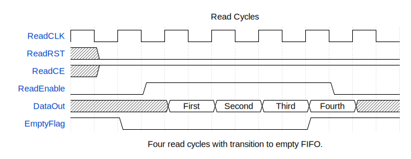

# Entity: AsyncFIFO

- **File**: AsyncFIFO.vhd

## Diagram

## Description

- Name: **Asynchronous FIFO**  
- Version: 1.1.1  
- Author: **Maximilian Passarello ([Blog](https://mpassarello.de))**  

Asynchronous FIFO with Gray Code Read & Write Pointer.

History:

- 1.1.1 (2024-03-10) Complete overhaul of AsyncFIFO:  
  *Added GrayCounter as a component  
  *Optimized port definitions  
  *Added timing diagrams  
  *Create async. Flag generation  
- 1.1.0 (2009-05-16) Initial version

## Timing Diagrams:

## Generics

| Generic name | Type    | Value         | Description                                         |
| ------------ | ------- | ------------- | --------------------------------------------------- |
| Width        | integer | 32            | FIFO Word width: Data width of the FIFO             |
| Depth        | integer | 4             | FIFO depth: Number of words the FIFO can store      |
| RamTypeFifo  | string  | "Distributed" | Implementation of the RAM: "Block" or "Distributed" |

### Virtual Buses

#### Write-Interface

| Port name   | Direction | Type                                 | Description                                                                                        |
| ----------- | --------- | ------------------------------------ | -------------------------------------------------------------------------------------------------- |
| WriteCLK    | in        | std_logic                            | Write clock; indipendent from the read clock. **Rising edge sensitive**                            |
| WriteRST    | in        | std_logic                            | Write reset; synchronous reset. **Active high**                                                    |
| WriteCE     | in        | std_logic                            | Write clock enable: Used for the `Write`- and `WriteGrayCounter`-process. **Active high**          |
| DataIn      | in        | std_logic_vector(Width - 1 downto 0) | Data input: Must be valid at the rising edge of the write clock if the write enable signal is set. |
| WriteEnable | in        | std_logic                            | Enable the write of the data to the FIFO, if the FIFO is not full. **Active high**                 |
| FullFlag    | out       | std_logic                            | Full flag: Indicates if the FIFO is full. **Active high**                                          |

#### Read-Interface

| Port name  | Direction | Type                                 | Description                                                                                                        |
| ---------- | --------- | ------------------------------------ | ------------------------------------------------------------------------------------------------------------------ |
| ReadCLK    | in        | std_logic                            | Read clock; indipendent from the write clock. **Rising edge sensitive**                                            |
| ReadRST    | in        | std_logic                            | Read reset; synchronous reset. **Active high**                                                                     |
| ReadCE     | in        | std_logic                            | Read clock enable: Used for the `Read`- and `ReadGrayCounter`-process. **Active high**                             |
| DataOut    | out       | std_logic_vector(Width - 1 downto 0) | Data output: The data is valid at the rising edge of the read clock one cycle after the read enable signal is set. |
| ReadEnable | in        | std_logic                            | Enable the read of the data from the FIFO, if the FIFO is not empty. **Active high**                               |
| EmptyFlag  | out       | std_logic                            | Empty flag: Indicates if the FIFO is empty. **Active high**                                                        |

## Signals

| Name                  | Type                                       | Description                                                                                                     |
| --------------------- | ------------------------------------------ | --------------------------------------------------------------------------------------------------------------- |
| Fifo                  | FifoType                                   | FIFO memory The FIFO memory is implemented as a RAM with the specified `RamTypeFifo`: "Block" or "Distributed". |
| ReadCounterEnable     | std_logic                                  | Increment enable signal for the read pointer.                                                                   |
| FifoEmpty             | std_logic                                  | Internal empty flag; forwarded to the output.                                                                   |
| ReadPointer           | std_logic_vector(AdressWidth - 1 downto 0) | Internal read pointer.                                                                                          |
| ReadPointerLookAhead  | std_logic_vector(AdressWidth - 1 downto 0) | Internal read pointer look ahead. (Read pointer + 1)                                                            |
| WriteCounterEnable    | std_logic                                  | Increment enable signal for the write pointer.                                                                  |
| FifoFull              | std_logic                                  | Internal full flag; forwarded to the output.                                                                    |
| WritePointer          | std_logic_vector(AdressWidth - 1 downto 0) | Internal write pointer.                                                                                         |
| WritePointerLookAhead | std_logic_vector(AdressWidth - 1 downto 0) | Internal write pointer look ahead. (Write pointer + 1)                                                          |

## Constants

| Name        | Type    | Value       | Description                                                                            |
| ----------- | ------- | ----------- | -------------------------------------------------------------------------------------- |
| AdressWidth | integer | log2(Depth) | FIFO memory address width: The address width is calculated from the depth of the FIFO. |

## Types

| Name     | Type | Description                         |
| -------- | ---- | ----------------------------------- |
| FifoType |      | FIFO memory type: `Depth` x `Width` |

## Functions

- log2 (N : integer) return integer
  - Calculate the log2 of a number

## Processes

- Flags: ( WritePointer, ReadPointer, WritePointerLookAhead )
  - **Description**
    Full and empty flags The full and empty flags are purely combinatorial calculated from a comparison of the read and write pointers/look ahead values.
- Write: ( WriteCLK )
  - **Description**
    Write process The write process writes the data to the FIFO if the FIFO is not full and the write enable signal is set. `WriteCountEnable` is used to synchronize the write pointer increment and is reset every time a rising edge of the write clock is detected.
- Read: ( ReadCLK )
  - **Description**
    Read process The read process reads the data from the FIFO if the FIFO is not empty and the read enable signal is set. `ReadCountEnable` is used to synchronize the read pointer increment and is reset every time a rising edge of the read clock is detected.

## Instantiations

- WriteGrayCounter: GrayCounter
  - Write pointer as Gray counter The write pointer is incremented by one from the `Write`-process if the FIFO is not full and the write enable signal is set. The look ahead value is used as the next write pointer value and to check if the FIFO is full.- ReadGrayCounter: GrayCounter
  - Read pointer as Gray counter The read pointer is incremented by one from the `Read`-process if the FIFO is not empty and the read enable signal is set. The look ahead value is used as the next read pointer value.
